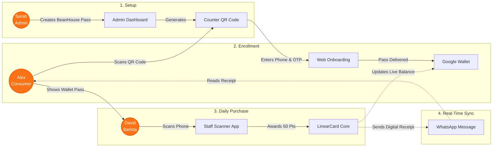

# Restaurant Use Case: BeanHouse Coffee

This document illustrates how LinearCard transforms the loyalty experience for a restaurant, using **BeanHouse Coffee** (our mock data tenant) as the real-world example.

## The Personas
1. **Brand Admin:** Sarah (Owner of BeanHouse Coffee)
2. **End Consumer:** Alex (Regular Customer)
3. **Brand Staff Scanner:** David (Barista)

---

## 📉 Before LinearCard vs. 📈 After LinearCard

### 👩‍💼 Sarah (Brand Admin)
* **Before:** Relied on easily lost paper punch cards. She had zero data on who her most loyal customers were, how often they visited, and had absolutely no way to contact them for promotions.
* **After:** Operates a fully digital, premium loyalty program. She owns a robust customer database and can send direct WhatsApp updates or push notifications directly to her customers' lock screens via Google Wallet.

### 🙎‍♂️ Alex (End Consumer)
* **Before:** Wallet was overflowing with paper cards that he constantly lost or forgot at home. He actively refused to download a dedicated "BeanHouse App" just to track coffee points, leading to a poor experience.
* **After:** **Zero apps downloaded.** He scanned a QR code at the counter once, and his BeanHouse pass now lives natively in his Google Wallet alongside his credit cards. He gets satisfying, instant WhatsApp receipts every time he buys a coffee.

### 👨‍🍳 David (Brand Staff Scanner)
* **Before:** Spent extra time physically stamping cards, slowing down the checkout line, and dealing with friction from customers who "lost their full card."
* **After:** Keeps the store tablet open to the LinearCard `/scan` route. When Alex holds up his phone, David scans it in 300ms, taps "Add 50 Points", and moves instantly to the next order.

---

## 🔄 The Use Case Flow (Horizontal)

The following diagram maps out the exact sequence of events horizontally: from Sarah setting up the program, to Alex getting his card, to David scanning it during a daily coffee run.

