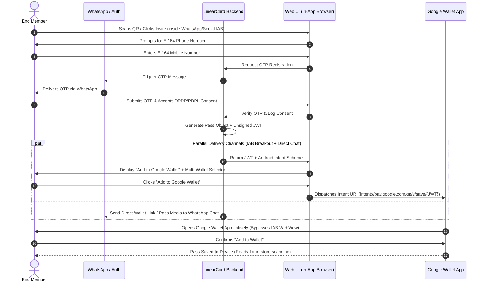
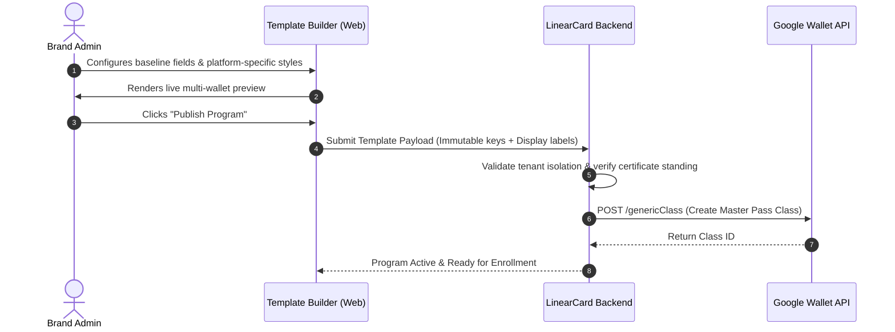
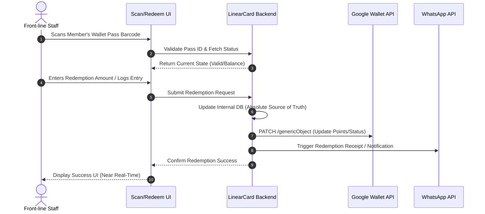
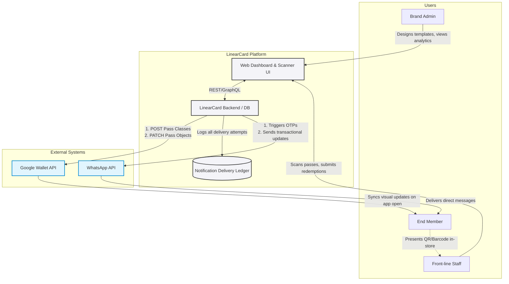
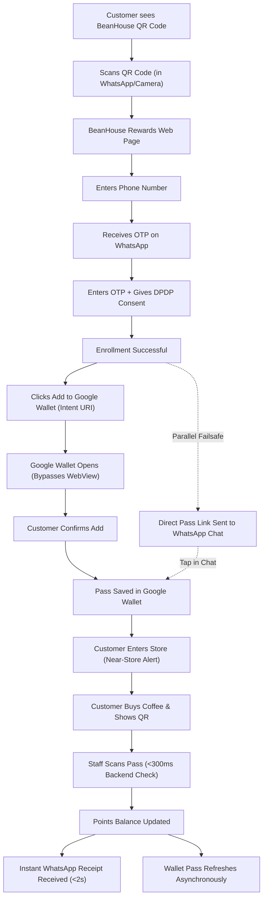
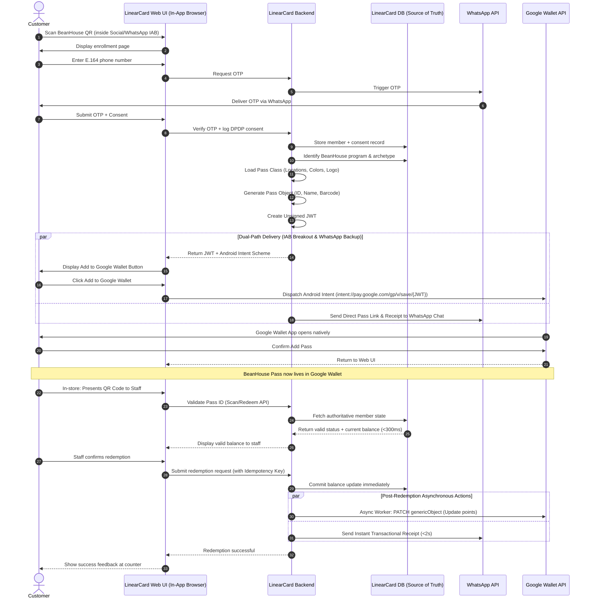

## **Section 1 → Project Overview & Requirements**

### **1. Project Goals**

> LinearCard aims to eliminate onboarding friction by allowing brands to rapidly issue wallet passes through a multi-tenant shared certificate architecture. This approach entirely bypasses the need for brands to secure their own developer accounts, enabling a fast and seamless deployment process.
> 

### **2. Core Use-Cases**

> The platform extends beyond basic loyalty stamps to support a full identity surface, specifically handling.
> 
1. **Loyalty Passes**: Track and reward customer purchases.
2. **Membership Cards**: Authenticate and manager program members
3. **ID Cards**: Provide digital identification for students and employees.
4. **Access Badges**: Grant secure entry to physical spaces like gyms or coworking spaces.

### **3. Target Personas**

1. **Brand Admins**: Marketing or operations leads who utilize a self-serve, visual dashboard to design pass templates and dispatch targeted notifications without needing technical expertise.
2. **End Members**: Consumers who authenticate via a phone-first identity model (E.164 + OTP) and receive passes and updates natively in their wallets or via WhatsApp.
3. **Front-line Staff**: Point-of-sale or gate personnel who rely on a fast, low-latency scan interface to immediately validate pass status and record redemptions.

### **4. End Product Description**

> Ultimately, LinearCard delivers a frictionless digital wallet ecosystem where brands can instantly deploy fully compliant loyalty and identity passes. By leveraging a single shared-certificate architecture, brands bypass traditional developer account bottlenecks. End members experience a seamless journey—enrolling via a simple WhatsApp OTP flow and clicking a native "Add to Google Wallet" button—resulting in a dynamic, scannable Generic Pass that lives directly on their device, ready for real-time validation by front-line staff.
> 

## **Section 2 → System Architecture & Process Flow**

### **1. User Onboarding Flow (WhatsApp E.164 + OTP → Google Wallet)**

> This flow dictates how well an end member discovers the program, authenticates in a region-compliant manner, and successfully saves their pass to Google Wallet. The “save to wallet” phase directly mirrors the integration mechanics observed in the Google Wallet API Developer tutorial.
> 



#### **Flow Breakdown and Technical Mapping**

1. **Identity & Consent**: The user initiates signup and authenticates using a phone-first identity model (`E.164 standard`) via a WhatsApp OTP. Explicit consent is captured at this stage to satisfy India's DPDP Act and GCC PDPL regulations.
2. **Payload Generation:** Once authenticated, the LinearCard backend provisions a unique **Pass Object** that inherits its template from the brand's master **Pass Class** (as demonstrated in the Google Wallet API structure). The backend packages this object into an **Unsigned JWT**.
3. **The "Save to Wallet" & IAB Breakout Step:** The frontend displays the official `Add to Google Wallet` button alongside a fallback selector. On Android, the button triggers an explicit Android Intent URI (`intent://pay.google.com/gp/v/save/{Unsigned_JWT}`) rather than a standard web navigation, breaking out of the sandboxed In-App Browser (WhatsApp/Instagram WebView) and handing off directly to the native Google Wallet application.
4. **Dual-Channel Handoff (WhatsApp Failsafe):** Simultaneously, the backend dispatches a direct pass link to the member's WhatsApp conversation. If the browser session is closed prematurely or an exotic WebView blocks the intent, the member can tap the link directly inside their native WhatsApp thread to complete the save.

### **2. Pass Creation Flow (Brand Admin → API)**

> This flow outlines how a Brand Admin designs a new wallet pass program without touching underlying code, mapping visual choices to Google Wallet's API architecture.
> 



### **3. Scan & Redemption Flow (In-store Validation)**

> This flow defines the interaction at the physical point-of-sale or gate. Due to asynchronous wallet syncing behavior (especially with Google Wallet's server-side update model), the system relies exclusively on the LinearCard backend as the definitive source of truth.
> 



### **4. Data Flow Diagram (Overview)**

> This diagram maps the high-level boundaries and data movement between the core LinearCard platform and the critical external APIs (Google Wallet and WhatsApp).
> 



## **Section 3 → API Integration & Data Architecture**

### **1. Authentication & Setup Architecture**

#### **A. Single Platform-Owned Account**

- LinearCard operates as a master service provider holding a single, verified **Google Pay and Wallet Issuer ID** obtained via the Google Pay and Wallet Console.
- Tenant brands do not register individual Google Developer accounts. All API requests are signed and dispatched using LinearCard’s master Google Cloud OAuth 2.0 Service Account Key.

#### **B. Multi-Tenant Isolation & Security**

- **Class Namespacing**: Every tenant program is allocated a unique `classId` structured as `{issuerId}.{tenant_id}_{program_id}` (e.g., `33881234567890.cafe_coffee_loyalty_v1` ).
- **Object Namespacing**: Individual passes derive from the parent class using `{issuerId}.{tenant_id}_{member_id}`
- **Data Isolation**: Data access and management operations are enforced strictly at the LinearCard API boundary. Tenant brand admins are authenticated via scoped tenant tokens, preventing any cross-tenant data access or mutation.
- **Abuse Monitoring**: Because all passes share LinearCard’s master certificate standing with Google, the platform enforces rate limiting, payload validation, and abuse monitoring to protect global certificate health.

### **2. API Integration Approach (REST API - Classes vs Objects)**

> LinearCard integrates with the **Google Wallet Generic Pass API** utilizing a two-tier structural hierarchy:
> 

```
+-----------------------------------------------------------------------+
|                       Pass Class (Template)                           |
|  * Defined ONCE per program by Brand Admin                            |
|  * Endpoint: POST /walletobjects/v1/genericClass                      |
|  * Stores: Logo, Program Title, Color Palette, Card Layout Templates  |
+-----------------------------------------------------------------------+
                                   |
                                   | 1 : N (Inheritance)
                                   v
+-----------------------------------------------------------------------+
|                       Pass Object (Instance)                          |
|  * Defined PER MEMBER upon enrollment / pass issuance                 |
|  * Endpoint: POST /walletobjects/v1/genericObject or Unsigned JWT     |
|  * Dynamic Updates: PATCH /walletobjects/v1/genericObject/{objectId}  |
|  * Stores: Barcode/QR, Member Name, Tier, Point Balance, Unique ID    |
+-----------------------------------------------------------------------+
```

#### **Key API Endpoint Patterns**

- **Class Creation (Admin Publishing)**:
    
    `POST https://walletobjects.googleapis.com/walletobjects/v1/genericClass`
    
    - Executed when a Brand Admin publishes a new pass template in the Template Builder.
- **Object Issuance (Member Onboarding):** Generated as an **Unsigned JWT** payload passed to the client via a direct **Android Intent URI** (`intent://pay.google.com/gp/v/save/{JWT}#Intent;scheme=https;package=com.google.android.apps.walletnf;end`) or web save fallback (`https://pay.google.com/gp/v/save/{JWT}`), with parallel delivery over WhatsApp.
- **Object Mutation (Scan & Redemption):**
    
    `PATCH https://walletobjects.googleapis.com/walletobjects/v1/genericObject/{resourceId}`
    
    - Executed asynchronously when front-line staff redeem points or alter member status. Modifies specific fields (e.g., point balance) on Google's servers without altering the underlying Pass Class.

#### **API Reliability & Integration Contracts (Idempotency, Queueing & Webhooks)**

> These are platform-wide API design principles (per PRD Section 8) that apply directly to the Google Wallet mutating endpoints above and to LinearCard's own brand-developer-facing API surface.
> 
- **Asynchronous Worker Queue:** Point-of-sale redemptions commit immediately to LinearCard's DB (`<300ms`), and wallet mutation tasks are offloaded to an asynchronous background worker queue (e.g., Redis/BullMQ) with automated retry and backoff mechanisms.
- **Idempotency Keys:** All mutating calls that touch `genericObject` state — Object Issuance and Object Mutation in particular — must accept a client-supplied idempotency key (`{pass_id}:{transaction_uuid}`) on LinearCard's API layer. This guards against duplicate `PATCH` calls from Scan/Redeem retries (e.g., flaky in-store network causing staff to re-submit a redemption) creating double-deductions or duplicate ledger entries.
- **HMAC-Signed Webhooks:** When a `genericObject` mutation succeeds (e.g., a redemption updates point balance), LinearCard's backend emits a signed webhook (HMAC-SHA256, with timestamp + nonce for replay protection) to any Brand Developer endpoints configured for that tenant, so brand-side systems can trust and verify enrollment/redemption events independently of polling Google's API.

### **3. Data Model Mapping Table**

> The following matrix maps LinearCard’s internal data schema to the corresponding JSON structures within the Google Wallet **Generic Pass API**, including geofencing and multi-archetype support:
> 

| **LinearCard Internal Concept** | **LinearCard Field Key** | **Google Wallet Generic Pass Field Path** | **Field Description & Behavior** |
| --- | --- | --- | --- |
| **Pass Identifier** | `pass_id` | `genericObject.id` | Format: `{issuerId}.{tenant_id}_{uuid}`. Primary key uniquely identifying the pass instance. |
| **Class Reference** | `program_id` | `genericObject.classId` | Format: `{issuerId}.{tenant_id}_{program_id}`. Binds object to parent template. |
| **Brand Logo** | `brand_logo_url` | `genericClass.logo.sourceUri.uri` | Class-level 1:1 brand icon displayed on top-left of the pass. |
| **Program Title** | `program_title` | `genericClass.cardTitle.defaultValue.value` | Class-level title (e.g., "Gold Tier Membership"). |
| **Header / Member Name** | `member_name` | `genericObject.header.defaultValue.value` | Primary text banner on the card front. |
| **Primary Balance / Points** | `member_balance` | `genericObject.cardTemplateOverride.cardRowTemplateInfos[0]` | First row layout slot (e.g., "500 Pts"). Updated via async REST `PATCH`. |
| **Secondary Status / Tier** | `member_tier` | `genericObject.cardTemplateOverride.cardRowTemplateInfos[1]` | Second row layout slot (e.g., "VIP Member"). |
| **Barcode / QR Code** | `barcode_value` | `genericObject.barcode.value` & `genericObject.barcode.type` | Scannable payload (`QR_CODE`, `CODE_128`) used by Front-line Staff. |
| **Hero Image / Banner** | `hero_banner_url` | `genericClass.heroImage.sourceUri.uri` | Class-level promo banner (10.3:3 aspect ratio) displayed in pass body. |
| **Pass Background Color** | `brand_hex_color` | `genericClass.hexBackgroundColor` | Custom brand accent color in `#RRGGBB` format. |
| **Member Details / Terms** | `terms_and_notes` | `genericObject.textModulesData[]` | Array of label/value objects in pass detail view. |
| **Store Geofencing** | `store_locations` | `genericClass.locations[]` / `genericObject.locations[]` | Lat/Long coordinates triggering on-device near-store lock screen alerts (~50m-1km). |
| **Member Photo (ID Cards)** | `member_photo_url` | `genericObject.imageModulesData[0].mainImage.sourceUri.uri` | Member portrait image slot for Digital ID Card archetypes. |
| **Validity Period** | `validity_dates` | `genericObject.validTimeInterval.end.date` | Formal pass expiration timestamp for memberships and IDs. |

## **Section 4 → Technical Challenges**

### 1. Wallet Detection & In-App Browser (IAB) Breakout

- Layout
    
    !image.png
    
- **Context & Challenge:** Mobile OS platforms do not provide an API to query installed wallet applications. Furthermore, because LinearCard prioritizes WhatsApp-first onboarding, over 80% of enrollment links are opened inside sandboxed In-App Browsers (such as WhatsApp, Instagram, or Facebook). These embedded **WebViews** frequently block custom intent schemes (`intent://`), fail to trigger native MIME-type downloads (`.pkpass`), and trap Google Wallet web redirects in isolated login prompts rather than deep-linking to the native wallet app.
- **Mitigation Strategy (4-Layer Progressive Resolution):**
    - **Layer 1: IAB Signature & Environment Detection:** The client inspects both `navigator.userAgent` (identifying IAB tokens like `WhatsApp`, `FBAN/FBAV`, `Instagram`) and modern Client Hints (`navigator.userAgentData`) to detect both the target OS (`Android` vs. `iOS`) and whether the execution context is an embedded WebView.
    - **Layer 2: Native Android Intent Dispatch:** For Android users on Google Wallet flows, the web interface utilizes an explicit Android Intent URI (`intent://pay.google.com/gp/v/save/{JWT}#Intent;scheme=https;package=com.google.android.apps.walletnf;end`) to force the OS to escape the embedded WebView and hand off the pass payload directly to the native Google Wallet / Google Play Services application.
    - **Layer 3: WhatsApp Direct Channel Handoff (Failsafe Bypass):** Capitalizing on LinearCard's core WhatsApp Business API integration, upon successful OTP verification, the backend automatically dispatches the pass directly to the member's WhatsApp chat thread (Google Wallet Save link for Android; `.pkpass` file attachment for iOS). Tapping from the native WhatsApp thread triggers the OS's native file/URL handler without browser sandbox friction.
    - **Layer 4: Defensive Fallback & Multi-Wallet Selector:** While the primary CTA defaults to the auto-detected OS wallet, the UI always renders a secondary option (*"Add to Samsung Wallet / Choose another wallet"*), preventing silent drop-offs for users with custom ROMs or secondary devices.

### 2. Pass Design & Template Constraints

- **Context & Challenge:** Native wallet platforms enforce rigid, proprietary layout systems with zero custom HTML/CSS capabilities. Apple Wallet uses fixed-character horizontal text slots (`header`, `primary`, `secondary`, `auxiliary`), while Google Wallet Generic Pass utilizes a 3-row structured template (`cardRowTemplateInfos`) and vertical text modules. Direct cross-platform rendering risks truncated text, missing brand assets, or illegible barcodes.
- **Mitigation Strategy (Canonical Schema & Asset Pipeline):**
    - **Unified Canonical Field Schema:** LinearCard enforces an abstracted data schema. Common attributes (Program Title, Member Name, Tier, Primary Balance, Barcode) map automatically to Apple's native slots and Google's row layout.
    - **Live Tri-Wallet Visual Preview & Character Clamping:** The visual Template Builder enforces strict character limits (e.g., max 12 chars for primary balance; max 20 chars for headers) and renders real-time side-by-side previews of Apple, Google, and Samsung Wallet cards with active overflow warnings.
    - **Automated Image Normalization Pipeline:** Brand Admins upload a single master asset kit (Square Logo + Hero Banner). LinearCard’s backend automatically crops, scales, and compiles platform-compliant asset packages (`icon@2x.png`, `logo@2x.png`, and `strip@2x.png` for Apple; 1:1 `logo` and 10.3:3 `heroImage` for Google Wallet).

### 3. Balance Update SLA & Sync Latency

- **Context & Challenge:** Dynamic wallet updates operate via asynchronous background mechanisms. Apple Wallet relies on APNs push tokens triggering device-side pull requests (`GET /v1/passes/...`), whereas Google Wallet updates data server-side via REST `PATCH` and syncs on app refresh. Promising an instantaneous lock-screen visual refresh across all devices creates an unreliable customer SLA due to variable OS battery optimization and network states.
- **Mitigation Strategy (Decoupled Source of Truth + Async Projection):**
    - **Authoritative Backend Ledger:** In-store POS validation and redemptions execute against LinearCard’s backend database within `<300ms`, completely independent of the customer’s wallet display state. Front-line staff see the true balance immediately.
    - **Asynchronous Wallet Mutation Pipeline:** Upon transaction commit, the backend enqueues wallet sync jobs (Google `PATCH` and Apple APNs triggers) with unique transaction idempotency keys, insulating POS operations from external API latencies.
    - **Instant WhatsApp Transactional Receipt:** Within 2 seconds of redemption, an automated WhatsApp receipt is dispatched to the member confirming their updated balance, providing immediate proof-of-transaction while the native wallet UI completes its background sync.

### 4. Push Notification Model & Audit Ledger

- **Context & Challenge:** Wallet providers do not expose a standalone "send push notification" messaging API. On Apple Wallet, notifications are triggered strictly as a side-effect of modifying a field containing a `changeMessage` format string. On Google Wallet, notifications require appending an entry to the `messages[]` array or updating `genericObject` data with `notifyPassModified`. Crucially, neither platform returns delivery or read receipts to integrators.
- **Mitigation Strategy (WhatsApp Primary Engagement + Honest Audit Ledger):**
    - **WhatsApp as the Primary Campaign Channel:** LinearCard routes all active marketing announcements, tier promotions, and milestone campaigns through the WhatsApp Business API, ensuring 98%+ open rates with verified read receipts.
    - **Transactional Pass Push Triggers:** Wallet push notifications are reserved strictly for transactional updates (points balance changes, tier upgrades), configured with localized `changeMessage` parameters on Apple and `messages[]` entries on Google.
    - **Durable Multi-State Delivery Ledger:** The platform's internal Notification Ledger explicitly separates delivery states: wallet updates are logged accurately as `DISPATCHED_TO_GATEWAY`, while WhatsApp messages track full `SENT`, `DELIVERED`, and `READ` lifecycles.

### 5. Proximity Geofencing (Native OS Limits vs. Privacy Compliance)

- **Context & Challenge:** Brand marketing teams frequently request wide-area proximity alerts (e.g., a 5 km radius around a mall). However, native wallet APIs restrict geofencing to micro-proximity triggers (~100m for Apple Wallet; ~50m–1km for Google Wallet) to protect device battery life and prevent notification spam.
- **Evaluated Options:**
    - **Option A (Native OS Near-Store Micro-Fencing — Recommended):** Embed physical store coordinates directly into the pass metadata (`locations[]` array, supporting up to 10 locations for Apple and 100 for Google).
    - **Option B (Custom 5 km Background GPS Tracking):** Force users into background web/app location polling to trigger 5 km WhatsApp marketing alerts.
- **Recommendation & Legal Justification (DPDP & GCC PDPL Compliance):**
    - **Adopt Option A as the Architectural Standard.** Option B introduces severe compliance liabilities under India's DPDP Act 2023 and GCC PDPL (violating Data Minimization and Purpose Limitation by tracking live user GPS) and breaks the "zero-app" value proposition.
    - **Zero Server-Side Location Overhead:** With Option A, store coordinates live inside the pass object, evaluated entirely on-device by iOS and Android OS services. LinearCard servers never collect, process, or store sensitive real-time user location data, guaranteeing effortless regulatory compliance.

### 6. Pass Archetype Differentiation within the Generic Pass API

- **Context & Challenge:** LinearCard supports four distinct identity archetypes (Loyalty Passes, Membership Cards, Digital ID Cards, and Access Badges). While Apple Wallet provides dedicated structural types (`storeCard`, `coupon`, `eventTicket`, `generic`), Google Wallet unifies non-payment passes under a single `genericClass` / `genericObject` API structure. Mapping all four archetypes onto identical generic slots risks losing archetype-specific features (e.g., portrait photos for ID cards or credential-first barcodes for access badges).
- **Mitigation Strategy (Archetype Preset Configuration Engine):**
    - **Archetype-Specific Google API Field Mapping:**
        - *Loyalty Passes:* Map point balances and tier status to `cardRowTemplateInfos[0..1]` with a dynamic `QR_CODE`.
        - *Membership Cards:* Bind validity dates to `validTimeInterval` and secondary member status to `textModulesData`.
        - *Digital ID Cards:* Inject the member photo via `genericObject.imageModulesData[]`, and surface verification badges alongside formal expiry timestamps.
        - *Access Badges:* Prioritize the barcode visual footprint (`barcode.renderEncoding = UTF_8`), binding physical access credential tokens and facility identifiers to `textModulesData`.
    - **Apple PassKit Type Binding:** The engine dynamically pairs each archetype to Apple's native schema (Loyalty & Membership → `storeCard`; ID Cards → `generic` with `thumbnail.png` photo module; Access Badges → `generic`/`eventTicket`).

## **Section 5 → Build, Delivery, and Rollout Process**

### **Phase 1: Proof of Concept (PoC) & Setup**

- **Account Setup:** Provision LinearCard’s master Google Pay and Wallet Issuer ID.
- **API Prototyping:** Validate the creation of a test `genericClass` and `genericObject` across all 4 archetypes using Google's REST API.
- **Client & IAB Breakout Testing:** Build a minimal Mobile Web test application to validate both Android Intent URI (`intent://...`) and web save URL execution inside WhatsApp and Instagram WebViews.
- **Identity Validation:** Prototype the WhatsApp E.164 phone verification (OTP) loop to ensure seamless token delivery.

### **Phase 2: Core Integration & Multi-Tenant Engine**

- **Multi-Tenant Backend & Namespacing:** Develop the core namespacing engine for `classId` and `objectId` to isolate tenant data securely.
- **Template Builder UI & Asset Pipeline:** Build the Brand Admin web dashboard, integrating the **Canonical Field Schema**, archetype presets, character clamping, and the **Automated Image Normalization Pipeline** (cropping 1:1 logos and 10.3:3 hero banners).
- **Asynchronous Worker Queue:** Implement a resilient queue (Redis/BullMQ) with client idempotency keys (`{pass_id}:{transaction_uuid}`) for background `PATCH` and APNs triggers.
- **WhatsApp CRM & Direct Delivery:** Integrate WhatsApp Business API for OTP verification, direct pass delivery upon signup, and instant transactional redemption receipts.
- **Scan/Redeem Interface:** Develop the Front-line Staff scanner web application querying LinearCard DB as the absolute source of truth.
- **Ledger & Consent Logging:** Implement the Notification Delivery Ledger (tracking `DISPATCHED` vs. `DELIVERED`/`READ`) and DPDP/PDPL consent capture database layer.

### **Phase 3: Testing & QA**

- **In-App Browser (IAB) Breakout QA:** Rigorous multi-device QA on Android Intent URIs and `.pkpass` handling across WhatsApp, Instagram, Facebook, and standard browsers.
- **On-Device Geofencing Validation:** Field-test lock screen micro-proximity triggers (~50m–1km) on iOS and Android devices without server-side location tracking.
- **Latency & Load Testing:** Benchmark the Scan/Redeem API calls to ensure in-store POS responses commit in `<300ms`.
- **Compliance & Security Audit:** Verify explicit DPDP Act and GCC PDPL consent capture, audit data minimization boundaries, and pen-test scoped tenant tokens.

### **Phase 4: Launch & Monitoring**

- **Soft Launch:** Deploy the platform with a select cohort of pilot brands in India and the GCC.
- **Health Monitoring:** Activate automated abuse monitoring on LinearCard’s master Google Wallet Issuer account to protect global certificate standing.
- **Analytics Deployment:** Roll out the dashboard's India vs. GCC performance splits and track notification delivery channel efficacy.
- **General Availability:** Full commercial rollout following the resolution of any pilot program bugs.

### **LinearCard Architecture Diagram**

```
                         LINEARCARD PLATFORM
┌─────────────────────────────────────────────────────────────┐
│                                                             │
│  Brand Admin UI                  Front-line Staff UI         │
│  ┌───────────────┐              ┌──────────────────┐        │
│  │ Template      │              │ Scan / Redeem    │        │
│  │ Builder       │              │ Interface        │        │
│  └───────┬───────┘              └────────┬─────────┘        │
│          │                               │                  │
│          └──────────────┬────────────────┘                  │
│                         ↓                                   │
│              ┌─────────────────────┐                        │
│              │ LinearCard Backend   │                        │
│              │ + Database (Truth)  │                        │
│              └──────────┬──────────┘                        │
│                         │                                   │
│              ┌──────────┴──────────┐                        │
│              ↓                     ↓                        │
│      Google Wallet API       WhatsApp API                   │
│      (Async Projection)      (Receipts & Campaigns)         │
│                                                             │
└─────────────────────────────────────────────────────────────┘
                 │
                 │ creates / updates
                 ↓
        ┌──────────────────────┐
        │  Google Wallet Pass  │
        │                      │
        │  Logo                │
        │  Member Name / Photo │
        │  Points / Status     │
        │  QR / Barcode        │
        │  Store Locations     │
        └──────────────────────┘
                 ↑
                 │
          Lives on user's
             phone
```

### **Flow - User Perspective (e.g., Coffee Shop → BeanHouse)**



### **Full Flow - Technical Perspective**

